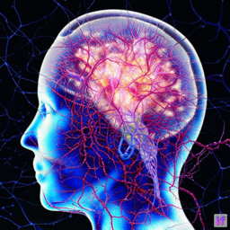
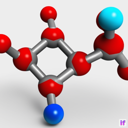

# T5 Textual Inversion for [DeepFloyd IF](https://github.com/deep-floyd/IF) on a 24 GB GPU
[*T5_Inversion.ipynb*](./T5_Inversion.ipynb) is **Copyright © 2023 [HANS ROETTGER](mailto:oss.roettger@posteo.org)** and distributed under the terms of **[AGPLv3](https://www.gnu.org/licenses/agpl-3.0.html)**.  

This is an implementation of the textual inversion algorithm to incorporate your own objects, faces, logos or styles into DeepFloyd IF.  
Input: a a couple of original images. Output: an embedding for a single token, that can be used in the standard DeepFloyd IF dream pipeline to generate your artefacts.

**I know you don't care about copyright, but at least leave me a ⭐ star in the top right!**

## Original Images ➡ T5 Embedding

</img>

Run the notebook to generate and save the T5 Embedding for your images. It takes about 35 minutes on a RTX 3090 GPU.

## T5 Embedding ➡ Deep Floyd IF Dream Pipeline
Load the T5 Embedding to a single token (e.g. "my") and use it in the standard DeepFloyd IF dream prompts.  

    def set_embedding(t5,emb,word="my"):
    with torch.no_grad():
        tokens=t5.tokenizer(word,max_length=77,padding='max_length',truncation=True,return_attention_mask=False,add_special_tokens=True,return_tensors='pt')
        assert tokens['input_ids'][0][1]==1, 'word is more then one token'
        tokenNo=tokens['input_ids'][0][0]
        assert t5.model.shared.weight[tokenNo].shape==emb.shape, 'wrong dimension of embedding'
        t5.model.shared.weight[tokenNo]=emb.to(t5.device)

    def load_embedding(t5,word="my",embedding_file="myToken.pt",no=0,path="./Embeddings/"):
        emb=torch.load(path+embedding_file)
        set_embedding(t5,emb,word)

    load_embedding(t5,word="my",embedding_file="myPuppet.pt",path="./Embeddings/")
    prompt="a photo of my at the beach"

<table style="width: 100%">
<tr>
    <td colspan=2></img></td>
    <td colspan=2></img></td>
    <td colspan=2></img></td>
    <td colspan=2></img></td>
    </tr>
</table>

## Better results with more input images and more training steps
### The myNN.pt embedding was trained on 33 neural network images
with learning_rates=[(50,0.5),(100,0.4),(200,0.3),(500,0.2),(2000,0.1),(2000,0.05)]

    load_embedding(t5,word="it",embedding_file="myNN.pt",path="./Embeddings/")
    prompt="a photo of it"

<table style="width: 100%">
<tr>
    <td colspan=2></img></td>
    <td colspan=2></img></td>
    <td colspan=2></img></td>
    <td colspan=2></img></td>
    </tr>
</table>

    prompt="a photo of a head made of it"

<table style="width: 100%">
<tr>
    <td colspan=2></img></td>
    <td colspan=2></img></td>
    <td colspan=2></img></td>
    <td colspan=2></img></td>
    </tr>
</table>

### The myMolecule.pt embedding was trained on 200 ball-and-stick model images
with learning_rates=[(50,0.5),(100,0.4),(200,0.3),(500,0.2),(2000,0.1),(2000,0.05)]

    load_embedding(t5,word="that",embedding_file="myMolecule.pt",path="./Embeddings/")
    prompt="3D rendering of that"

<table style="width: 100%">
<tr>
    <td colspan=2></img></td>
    <td colspan=2></img></td>
    <td colspan=2></img></td>
    <td colspan=2></img></td>
    </tr>
</table>

    prompt="3D rendering of a robot made of that"

<table style="width: 100%">
<tr>
    <td colspan=2></img></td>
    <td colspan=2></img></td>
    <td colspan=2></img></td>
    <td colspan=2></img></td>
    </tr>
</table>

     

## Prerequisites
* A working  [DeepFloyd IF](https://github.com/deep-floyd/IF) environment
* A GPU with at least 24 GB CUDA memory

## Installation
* Copy the [*T5_Inversion.ipynb*](./T5_Inversion.ipynb) notebook into your DeepFloyd IF environment. All you need is in the small notebook.
* Set the paths to your local models at the top of the notebook. Restart and run all!
* The t5-v1_1-xxl/IF-I-M-v1.0 models in training mode closely fit into 24 GB CUDA memory.
* If you run into out of memory errors, try to remove the "safety_checker" & "watermarker" from the "model_index.json" files to save up some memory (see template in this repository).

## Issues
* Since DeepFloyd IF uses a puny 64x64 pixel resolution in Stage_I, the results are not as good as textual inversion for stable diffusion, but far better than expected.
* I haven't explored all parameter combinations yet - especially the learning rates are tricky. Take this implementation as a starting point for your own experiments.
* If you get totally blurred results, DeepFlod IF has detected "nudity" in /deepfloyd_if/modules/base.py (226) sample = self.__validate_generations(sample).
* I couldn't try out the T5 Inversion with the IF-I-XL-v1.0 model due to CUDA memory restrictions. Maybe there is someone out there with a RTX6000, A100 or H100? Feedback welcome!

